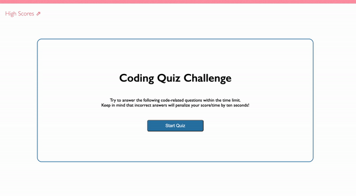

# Timed Coding Assessment Quiz Javascript App

## Description

The Timed Coding Assessment Quiz is a simple javascript app which presents the user with a series of questions and a time limit in which they need to be answered.

This app operates through the use of javascript <code>functions</code>, <code>onclick</code> events, and the <code>localstorage</code> property of the window interface.

## Installation

To operate the Timed Coding Assessment Quiz, a user must have a browser that supports Javascript and has it enabled.

## Usage

Opening the [Timed Coding Assessment Quiz Webpage] () and clicking the "Start Quiz" button will initiate the quiz time clock countdown of 75 seconds.

The user will be presented with a series of five multiple choice questions. If the user answers a question incorrectly, ten seconds will be deducted from the time clock.

The user's score is defined as the time remaining on the clock after all questions have been answered.

If the time clock reaches zero before the user has answered all questions, the quiz will automatically end and the user's score will be set to zero.

After the user has finished the quiz or the time clock has reached zero, the user may log their score into the high score list by entering their initials into the text field and pressing the "Save Score" button.

The high score list can be accessed by clicking the "High Scores" link on the upper left of the page.

The "High Scores" link will direct the user to a separate page with a list of the scores saved to local storage.

The user may clear the high scores saved to local storage by clicking the "Clear High Scores" button.

From the high scores page, the user may navigate back to the quiz homepage by clicking the "Return to Quiz" button.

## Credits

* [Geeks for Geeks](https://www.geeksforgeeks.org/create-a-quiz-app-with-timer-using-html-css-and-javascript/) was instrumental in providing an example for how this app should operate. With this example and the information provided by the UCB Bootcamp, I could understand and implement the necessary operations for the app.

* [mdn web docs_](https://developer.mozilla.org/en-US/docs/Web/API/Window/localStorage) was used for information on <code>localstorge</code> properties.

* [w3 Schools](https://www.w3schools.com/) was used for information on various elements of the javascript functions and how to stylize the <code>ol</code>.

## License
N/A